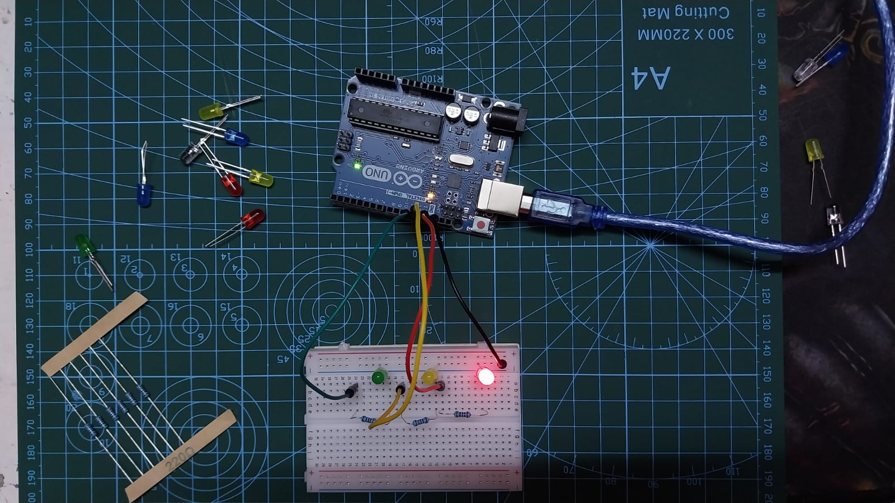

# Traffic Light System

3-LED traffic light with timing sequence.

## Demo

## What I Learned
- **LED polarity the hard way:** Long leg = positive (anode), short leg = negative (cathode)
- Discovered this by troubleshooting - one LED was blinking because I had it backwards
- Sequential LED control with digitalWrite()
- Timing control with delay()
- Real-world debugging: observe behavior, identify issue ,fix

## Components
- 1x Arduino UNO
- 1x Green LED
- 1x Yellow LED  
- 1x Red LED
- 3x 220Ω resistors
- Breadboard + jumper wires

## Sequence
1. Green: 2.5 seconds (GO)
2. Yellow: 1.5 seconds (PREPARE TO STOP)
3. Red: 1.5 seconds (STOP)
4. Repeat

## Code
See [traffic_light.ino](traffic_light.ino)

## Challenges Solved
**Problem:** One LED was blinking instead of staying on  
**Root cause:** LED installed backwards (polarity reversed)  
**Solution:** Identified long leg (anode) goes to positive side  
**Lesson:** Always check LED polarity - this won't happen again!

---
**Date:** Feb 5, 2026  
**Time:** 2 hours (including troubleshooting)  
