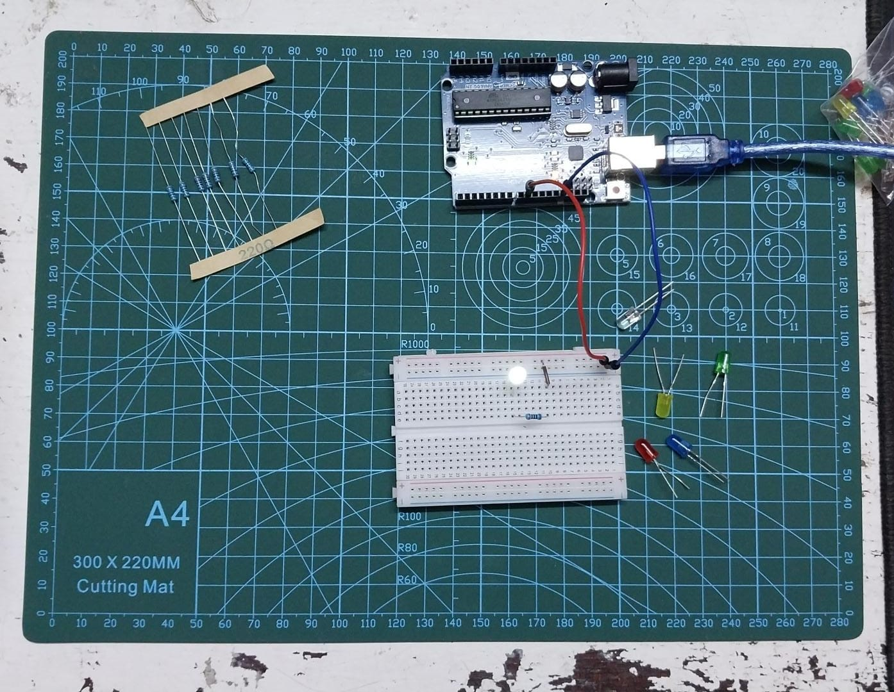

# Fading LED (PWM Control)

LED smoothly fades in and out using Pulse Width Modulation (PWM).

## Demo



## What I Learned

**PWM (Pulse Width Modulation):**
- `analogWrite(pin, value)` - Controls LED brightness
- Value range: 0 (off) to 255 (full brightness)
- PWM pins on Arduino UNO: 3, 5, 6, 9, 10, 11 (marked with ~)
- PWM = rapidly switching pin HIGH/LOW at different duty cycles

**For Loops:**
- `for(int i = 0; i <= 255; i++)` - Increment brightness
- `for(int i = 255; i >= 0; i--)` - Decrement brightness
- Loop variable controls fade speed and smoothness

**Smooth Transitions:**
- Small increment (5) + short delay (5ms) = smooth fade
- Larger increment = faster but choppier fade
- Delay controls overall speed

## Components
- 1x Arduino UNO
- 1x LED 
- 1x 220Ω resistor
- Breadboard + jumper wire

## Code

See [fading_led.ino](fading_led.ino)

**Key concepts:**
```cpp
analogWrite(ledPin, fade);  // PWM output (0-255)
for(int fade = 0; fade <= 255; fade += 5)  // Fade in
for(int fade = 255; fade >= 0; fade -= 5)  // Fade out
```

**How it works:**
1. First loop: Increase brightness from 0 to 255 (fade in)
2. Each step increases by 5, waits 5ms
3. Second loop: Decrease brightness from 255 to 0 (fade out)  
4. Each step decreases by 5, waits 20ms (slower fade out)
5. Repeats continuously

---
**Date:** Feb 11, 2026 
**Time Spent:** 1.5 hours  
