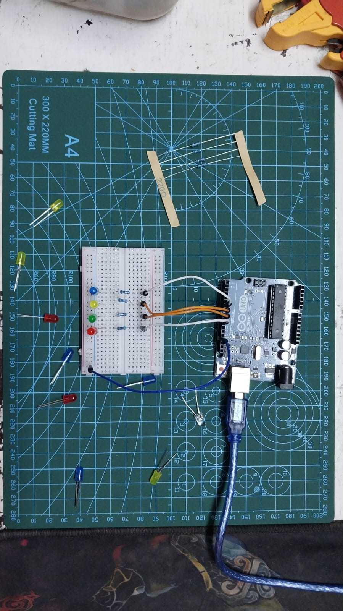

# LED Patterns (Arrays & Loops)

Multiple LEDs in chase pattern - forward then backward.

## Demo

## What I Learned

**Arrays:**
- `int ledPins[] = {6, 7, 8, 9}` - Store multiple pin numbers in one variable
- Access elements: `ledPins[0]` = 6, `ledPins[1]` = 7, etc.
- Array index starts at 0
- Easy to add more LEDs (just add to array)

**Array Length:**
- `int LedCount = 4` - Store array size separately
- Used in loops to iterate through all LEDs
- Makes code scalable (change one number to add more LEDs)

**For Loops with Arrays:**
- `for(int pin = 0; pin < LedCount; pin++)` - Loop through array
- Use loop variable as array index: `ledPins[pin]`
- Increment (pin++) goes forward
- Decrement (pin--) goes backward

**Bidirectional Pattern:**
- First loop: 0 to 3 (forward chase)
- Second loop: 3 to 0 (backward chase)  
- `LedCount - 1` = last index (array[3] for 4 LEDs)
- Creates seamless back-and-forth effect

**The Struggle:**
- Using loop variable as array index (`ledPins[pin]`)
- Backward loop logic (`pin >= 0` and `pin--`)
- **Didn't give up - studied docs until it clicked**

## Components
- 1x Arduino UNO
- 4x LEDs (any colors)
- 4x 220Ω resistors
- Breadboard + jumper wires

## Code
See [led_patterns.ino](led-patterns.ino)

## Challenges Solved

**Backward loop**
- First tried `for(int pin = 4; pin > 0; pin--)`
- Got error - array[4] doesn't exist (only 0-3)
- **Solution:** Start at `LedCount - 1` (which is 3)
- Loop condition: `pin >= 0` (include 0)

**Learning method:**
- Read Arduino array documentation

- **NO VIDEOS - pure documentation understanding**

**Tried different patterns:**
- All on, all off (changed loop to not turn off each time)
- Faster chase (timer = 50)
- Slower chase (timer = 200)
- Only forward (removed second loop)
---
**Date:** Feb 11, 2026  
**Time Spent:** 2 hours (including struggle/study time)  
