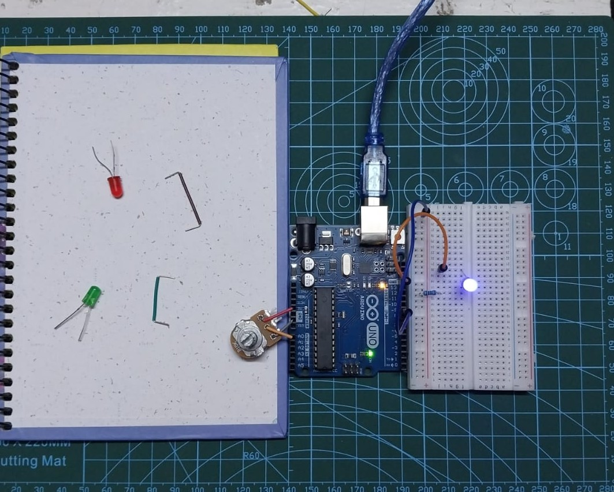

# Project 07: Potentiometer Dimmer

Turn potentiometer knob to control LED brightness in real-time.

## Demo



## Components
- 1x Arduino UNO
- 1x 10kΩ Potentiometer
- 1x LED
- 1x 220Ω resistor
- Breadboard + jumper wires

## Circuit
```
Potentiometer:
- Left leg   GND
- Right leg  5V
- Middle (wiper)  A0

LED:
- Pin 9 (~PWM)  220Ω  LED (+)  LED (-)  GND
```

## New Concepts Learned

- **Potentiometer:** Variable resistor with 3 legs
  - Left = GND, Right = 5V, Middle (wiper) = signal
  - Turning knob changes voltage at wiper (0V - 5V)
  - Works like a sensor detecting voltage change position

- **`analogRead(pin)`:** Reads analog voltage from A0-A5
  - Returns value: 0 (0V) to 1023 (5V)
  - 10-bit resolution (2^10 = 1024 steps)

- **`map(value, fromLow, fromHigh, toLow, toHigh)`:**
  - Converts one range to another
  - Used to convert pot range (0-1023) PWM range (0-255)
  - Essential when input/output ranges doesn't match

- **Range mismatch problem:**
  - analogRead returns 0-1023
  - analogWrite accepts 0-255
  - map() solves this by scaling proportionally

## How It Works

1. Potentiometer acts as voltage divider
2. Turning knob changes voltage at wiper (middle leg)
3. `analogRead()` reads this voltage as 0-1023
4. `map()` converts 0-1023 to 0-255
5. `analogWrite()` sets LED brightness using converted value
6. 3ms delay for stability
7. Repeat = real-time brightness control

## The Challenge

**Problem:** analogRead returns 0-1023 but analogWrite only takes 0-255

**My thinking process:**
- Understood pot = voltage sensor (not just a knob)
- Read pot has 3 legs: power, ground, wiper
- Wiper outputs changing voltage based on position
- analogRead captures this change
- Realized range mismatch (1023 and 255)
- Drew notes and diagrams to understand the ranges
- Searched for function to convert ranges and found map()
- Tested, worked perfectly

**Key insight:** 
"The potentiometer doesn't just change resistance, it changes 
voltage proportionally - that's what analogRead captures"

**Time to solve:** 2.5 hours of pure thinking
**Method:** Documentation only, zero videos

## Code
See [potentiometer_dimmer.ino](potentiometer_dimmer.ino)

---
**Date:** Feb 12, 2026
**Time:** 2.5 hours
**Method:** Documentation only, zero videos
